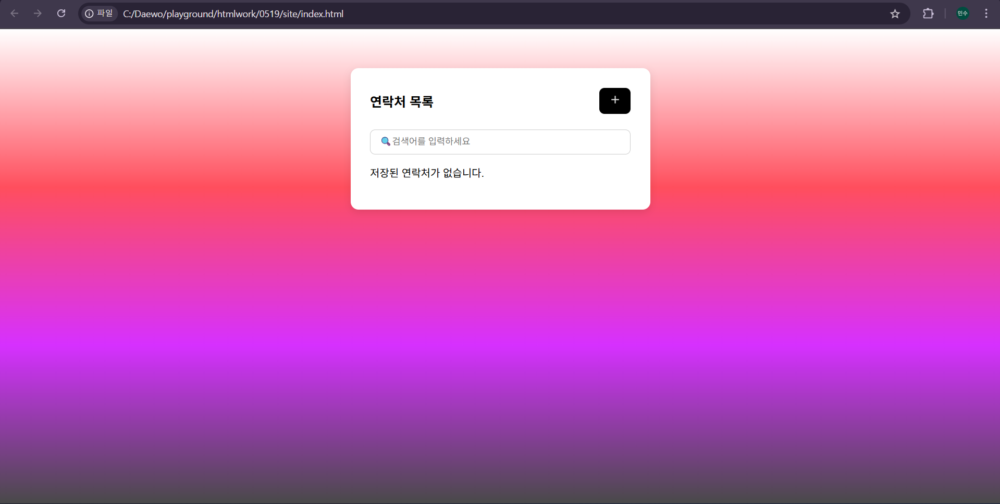
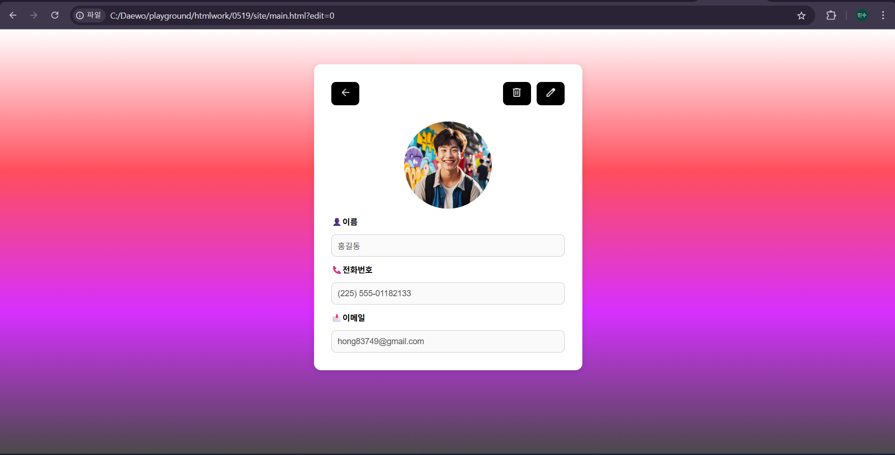

# 구성화면
* 메인 화면 
  연락처 추가화면 

# HTML

* 메인 페이지
```html
<!DOCTYPE html>
<html lang="ko">
<head>
  <meta charset="UTF-8" />
  <meta name="viewport" content="width=device-width, initial-scale=1" />
  <title>연락처 목록</title>
  <link rel="stylesheet" href="style.css" />
</head>
<body>
<div class="edit-container">
  <div class="top-bar">
    <h1 id="list">연락처 목록</h1>
        <button type="button" class="plus-btn">
            
        </button>
  </div>

  <div class="search-bar">
        <input type="text" id="searchInput" placeholder="🔍검색어를 입력하세요" />
  </div> 
  <div id="contact-list"></div>
</div>

<script>
  document.querySelector('.plus-btn').addEventListener('click', () => {
    window.location.href = 'sub.html';
  });

  const contacts = JSON.parse(localStorage.getItem('contacts') || '[]');
  const contactList = document.getElementById('contact-list');

  if (contacts.length === 0) {
    contactList.innerHTML = '<p>저장된 연락처가 없습니다.</p>';
  } else {
    contacts.forEach((contact, index) => {
  const item = document.createElement('div');
  item.className = 'contact-item';
  item.innerHTML = `
  <div class="contact-info">
    
    <div class="contact-text">
      <span class="contact-name">${contact.name}</span>
      <span class="contact-phone">${contact.phone}</span>
      <span class="contact-email">${contact.email}</span>
    </div>
  </div>
`;

  contactList.appendChild(item);
});

    document.querySelectorAll('.small-profile-img').forEach(img => {
      img.addEventListener('click', (event) => {
        const index = event.target.dataset.index;
        window.location.href = `main.html?edit=${index}`;
      });
    });
  }
</script>
</body>
</html>
```

* 연락처 상세 페이지
```html
<!DOCTYPE html>
<html lang="ko">
<head>
  <meta charset="UTF-8" />
  <meta name="viewport" content="width=device-width, initial-scale=1.0" />
  <title>연락처 상세</title>
  <link rel="stylesheet" href="style.css" />
</head>
<body>
<div class="edit-container">
  <form class="edit-form">
    <div class="button-group">
      <div class="left-buttons">
        <button type="button" class="back-btn">
          
        </button>
      </div>
      <div class="right-buttons">
        <button type="button" class="delete-btn">
          
        </button>
        <button type="button" class="edit-btn">
          
        </button>
      </div>
    </div>

    <div class="photo-section">
      
    </div>

    <label for="name">👤이름</label>
    <input type="text" id="name" name="name" disabled />

    <label for="phone">📞전화번호</label>
    <input type="tel" id="phone" name="phone" disabled />

    <label for="email">📩이메일</label>
    <input type="email" id="email" name="email" disabled />
  </form>
</div>

<script>
  const params = new URLSearchParams(window.location.search);
  const editIndex = params.get('edit');
  const contacts = JSON.parse(localStorage.getItem('contacts') || '[]');

  if (editIndex !== null && contacts[editIndex]) {
    const contact = contacts[editIndex];
    document.querySelector('#name').value = contact.name;
    document.querySelector('#phone').value = contact.phone;
    document.querySelector('#email').value = contact.email;
    if (contact.image) {
      document.querySelector('.profile-img').src = contact.image;
    }
  }

  document.querySelector('.back-btn').addEventListener('click', () => {
    window.location.href = 'index.html';
  });

  document.querySelector('.delete-btn').addEventListener('click', () => {
    if (confirm('정말 삭제하시겠습니까?')) {
      contacts.splice(editIndex, 1);
      localStorage.setItem('contacts', JSON.stringify(contacts));
      alert('삭제되었습니다.');
      window.location.href = 'index.html';
    }
  });

  document.querySelector('.edit-btn').addEventListener('click', () => {
    window.location.href = `sub.html?edit=${editIndex}`;
  });
</script>
</body>
</html>
```

* 연락처 수정 페이지
```html
<!DOCTYPE html>
<html lang="ko">
<head>
  <meta charset="UTF-8" />
  <meta name="viewport" content="width=device-width, initial-scale=1.0" />
  <title>연락처 편집</title>
  <link rel="stylesheet" href="style.css" />
</head>
<body>
<div class="edit-container">
  <form class="edit-form" id="editForm">
    <div class="button-group">
      <div class="left-buttons">
        <button type="button" class="back-btn">
          
        </button>
      </div>
      <div class="right-buttons">
        <button type="submit" class="check-btn">
          
        </button>
      </div>
    </div>

    <div class="photo-section">
      
      <input type="file" id="photoInput" accept="image/*" style="display: none;" />
    </div>

    <label for="name">👤이름</label>
    <input type="text" id="name" name="name" />

    <label for="phone">📞전화번호</label>
    <input type="tel" id="phone" name="phone" />

    <label for="email">📩이메일</label>
    <input type="email" id="email" name="email" />
  </form>
</div>

<script>
  const params = new URLSearchParams(window.location.search);
  const editIndex = params.get('edit');
  const contacts = JSON.parse(localStorage.getItem('contacts') || '[]');

  const profileImg = document.querySelector('#profileImage');
  const fileInput = document.querySelector('#photoInput');

  // 이미지 클릭 시 파일 선택 창 열기
  profileImg.addEventListener('click', () => {
    fileInput.click();
  });

  // 기존 정보 불러오기
  if (editIndex !== null && contacts[editIndex]) {
    const contact = contacts[editIndex];
    document.querySelector('#name').value = contact.name;
    document.querySelector('#phone').value = contact.phone;
    document.querySelector('#email').value = contact.email;
    if (contact.image) {
      profileImg.src = contact.image;
    }
  }

  // 이미지 업로드 시 미리보기
  fileInput.addEventListener('change', (e) => {
    const file = e.target.files[0];
    if (file) {
      const reader = new FileReader();
      reader.onload = function (event) {
        profileImg.src = event.target.result;
      };
      reader.readAsDataURL(file);
    }
  });

  // form 제출 시 저장
  document.getElementById('editForm').addEventListener('submit', (e) => {
    e.preventDefault();

    const name = document.querySelector('#name').value.trim();
    const phone = document.querySelector('#phone').value.trim();
    const email = document.querySelector('#email').value.trim();
    const image = profileImg.src;

    if (!name) {
      alert('이름을 입력하세요.');
      return;
    }

    const newContact = { name, phone, email, image };

    if (editIndex !== null && contacts[editIndex]) {
      contacts[editIndex] = newContact; // 수정
    } else {
      contacts.push(newContact); // 추가
    }

    localStorage.setItem('contacts', JSON.stringify(contacts));
    window.location.href = 'index.html';
  });

  // 뒤로가기 버튼
  document.querySelector('.back-btn').addEventListener('click', () => {
    window.location.href = 'index.html';
  });
</script>
</body>
</html>

```

# CSS

```css
body {
  font-family: 'Arial', sans-serif;
  margin: 0;
  padding: 0;
  display: flex;
  justify-content: center;
  align-items: flex-start;
  min-height: 100vh;

  /* background 이미지 주석 처리 중 */
  /* background-image: url('img/treegif.png'); */
  /* background-size: contain;
  background-repeat: no-repeat;
  background-position: center center;
  background-attachment: fixed;
  background-color: #000; */
  background: linear-gradient(to bottom, #ffffff, #ff4e5d, #d630ff, #494949);
  background-attachment: fixed;
}

.edit-container {
  background: white;
  padding: 30px;
  margin-top: 60px;
  border-radius: 12px;
  box-shadow: 0 4px 12px rgba(0,0,0,0.1);
  width: 100%;
  max-width: 400px;
}

h1 {
  text-align: center;
  margin-bottom: 24px;
  color: #000000;
}

.edit-form {
  display: flex;
  flex-direction: column;
  gap: 12px;
}

.photo-section {
  display: flex;
  flex-direction: column;
  align-items: center;
  gap: 8px;
}

.profile-img {
  width: 150px;
  height: 150px;
  border-radius: 50%;
  object-fit: cover;
}

.photo-label {
  cursor: pointer;
  font-size: 14px;
  color: #007bff;
  text-decoration: underline;
}

input[type="file"] {
  display: none;
}

label {
  font-weight: bold;
  font-size: 14px;
}

input[type="text"],
input[type="tel"],
input[type="email"] {
  padding: 10px;
  border: 1px solid #ccc;
  border-radius: 8px;
  font-size: 14px;
}

.button-group {
  display: flex;
  justify-content: space-between;
  align-items: center;
  margin-bottom: 16px;
}

.left-buttons {
  flex: 1;
  display: flex;
  justify-content: flex-start;
}

.right-buttons {
  flex: 1;
  display: flex;
  justify-content: flex-end;
  gap: 10px;
}

.back-btn,
.delete-btn,
.edit-btn,
.save-btn,
.plus-btn,
.check-btn {
  padding: 8px 14px;
  font-size: 14px;
  border: none;
  border-radius: 8px;
  cursor: pointer;
  background-color: #000000;
  color: #ffffff;
}

.back-btn img,
.delete-btn img,
.edit-btn img,
.save-btn img,
.plus-btn img,
.check-btn img {
  width: 20px;
  height: 20px;
}

.contact-item {
  display: flex;
  justify-content: space-between;
  padding: 10px 8px;
  border-bottom: 1px solid #ddd;
  align-items: center;
}

.contact-info {
  font-size: 14px;
  color: #333;
  display: flex;
  align-items: center;
  gap: 10px;
}

.contact-actions button {
  margin-left: 6px;
  background: none;
  border: none;
  cursor: pointer;
  font-size: 16px;
}

.small-profile-img {
  width: 80px;       /* 원하는 너비 */
  height: 80px;      /* 원하는 높이 */
  object-fit: cover; /* 이미지 비율 유지하며 잘라내기 */
  border-radius: 50%; /* 동그란 이미지로 보이게 하기 (선택 사항) */
  margin-right: 10px; /* 텍스트와의 간격 */
}

.contact-text {
  display: flex;
  flex-direction: column;
  font-size: 14px;
  color: #333;
}

.top-bar {
  display: flex;
  justify-content: space-between;
  align-items: center;
  margin-bottom: 24px;
}

.top-bar h1 {
  margin: 0;
  font-size: 20px;
  color: #000;
}
.search-bar {
  margin-bottom: 16px;
  width: 100%;
}

#searchInput {
  width: 100%;
  padding: 10px 14px;
  font-size: 14px;
  border: 1px solid #ccc;
  border-radius: 8px;
  box-sizing: border-box;
}
```
