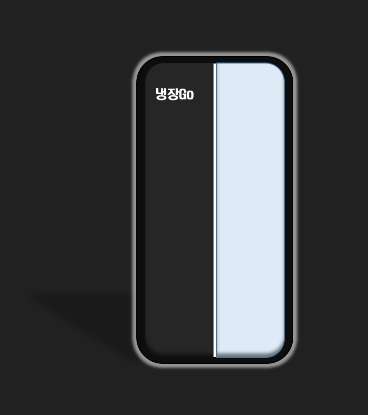
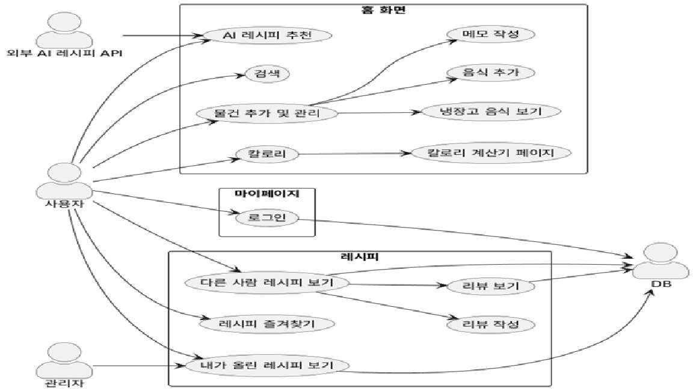

---
 ## 프로젝트
* AI 요리 추천 서비스(냉장Go)

  
## 팀별 구성
* 프론트엔드-김무일 박민수

* 백엔드-김상연 김신중

## AI 기반 식단 & 영양 관리 앱
- 개인 맞춤형 식단 추천-> AI 기반 건강 분석(칼로리) & 조언
- 다른 사용자와 식단 공유, 레시피 추천
- 가정 내 식재료 기반 맞춤 요리 추천 -> 사용자가 냉장고에 있는 재료를 입력하면, AI가 활용 가능한 레시피 추천

## 차별화
* 운동 + 식단 통합 관리 (AI가 효율적인 식사 제안)
* AI 기반 자동 레시피 생성 & 맞춤형 식사 플랜
* 영양소 분석 및 보충 필요성 실시간 피드백
* AI 맞춤 식단 추천 (건강 목표 & 유전자 기반)

## 기능
* 재료기준 추천
* 칼로리계산기능
* 팝업형 메모
* 유저 피드백+추천(평점(*****)_피드백)

## 유스케이스 다이어그램
* 

## 시나리오
* AI 레시피 추천

사용자가 보유한 재료 정보를 기반으로 AI가 레시피를 추천한다. 추천된 목록에서 사용자는 원하는 레시피를 선택해 상세 정보를 확인할 수 있다.

* 검색

음식명이나 재료 키워드를 입력하여 관련 레시피를  조회한다. 검색 결과에서 원하는 레시피를 선택해 상세 내용을 확인할 수 있다.

* 물건 추가 및 관리

사용자가 냉장고 속 재료를 등록하고 목록에서 확인하거나 수정할 수 있다. 등록된 재료는 이후 AI 추천이나 레시피 필터링에 활용된다.

* 칼로리 계산

사용자가 음식명을 검색하거나 직접 입력해 칼로리를 계산한다. 계산 결과는 건강 관리나 음식 선택에 참고할 수 있다.

* 메모

중요한 정보나 나중을 위해 입력하는 정보로 메모 창을 선택하면 새로운 팝업창의 형식으로 확인 가능하다.

* 리뷰

레시피에 대한 별점과 후기 기능을 통한 작성, 다른 사람의 리뷰도 확인 가능하다. 레시피 선택에 도움을 주는 참고 정보로 제공한다.

