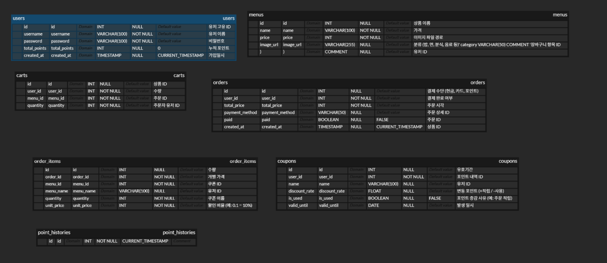

<p>$\large{\rm{\color{#5ad7b7}PCEat(피씨잇)}}$</p> PC방 푸드 포인트 웹 사이트

# 프로젝트 개요
  * PC방 이용 고객을 위한 음식 주문 포인트 적립 웹서비스 개발을 목표로 합니다.
  * 고객이 음식을 주문할 때마다 포인트를 자동으로 적립하고, 적립된 포인트를 할인이나 이벤트 참여 등에 사용할 수 있도록 하여, 이용자의 만족도 향상과 점포 매출 증대를 기대합니다.

# 기획 배경
 * 높은 음식 가격: PC방 내에서 판매되는 음식은 외부 음식점보다 가격이 비싼 경우가 많습니다. 이는 이용 고객에게 금전적인 부담으로 작용할 수 있습니다. 
 * 지속적인 지출: 편리함 때문에 계속해서 PC방 내에서 음식을 주문하다 보면, 예상보다 많은 지출로 이어질 수 있습니다.

# 목표
 * 포인트 적립 기능을 통해 고객의 반복 이용을 유도
 * 포인트를 활용한 음식 할인 및 이벤트 참여 시스템 구현
 * 웹 기반 플랫폼을 통해 관리자의 운영 편의성과 고객의 접근성을 동시에 확보
 * 향후 이용 데이터 분석  기반의 마케팅 확장성 고려

# 주요 기능
 * 온라인 음식 주문
   * PC방 내 자리에서 웹사이트를 통해 메뉴를 확인하고 비대면으로 손쉽게 음식 주문 가능→ 직원 호출 없이 편리한 주문 환경 제공
 * 포인트 자동 적립
   * 주문 시 회원 정보 기반으로 포인트가 자동 적립→ 누적된 포인트는 마이페이지에서 확인 가능, 이용자 참여 유도
   * 포인트로 할인 및 이벤트 참여
   * 적립된 포인트를 사용해 음식 결제 시 할인을 받거나경품 이벤트, 기간 한정 프로모션 등 다양한 혜택에 참여 가능→ 고객 충성도 강화 및 마케팅 활용도 증가
  
 # 진행 계획
  * 역할 분담
    * 개발: 프론트엔드·백엔드 기능 구현 및 DB 설계
    * 디자인: 사용자 인터페이스(UI) 및 사용자 경험(UX) 설계
    *  테스트: 기능 검증, 오류 수정, 사용자 피드백 수집
    *  기획: 서비스 구조 및 기능 정의, 사용자 흐름 설계
   
  # 기술 구성
   * 주요 개발 언어/프레임워크:
     * 스프링 부트 (Spring Boot): 빠르고 쉽게 독립 실행형 스프링 기반 애플리케이션을 만들 수 있어, 안정적이고 효율적인 서버 개발에 적합
     * 자바 (Java): 스프링 부트의 기반 언어로, 객체 지향적이며 방대한 라이브러리와 높은 안정성.
   * 데이터베이스:
     * MySQL: 오픈소스 관계형 데이터베이스로, 안정성과 성능이 뛰어나며 대규모 데이터 처리에도 효과적
     * 톰캣: 스프링 부트 서비스와 연결을 원활히 하게 하기 위한 서버
   * 코드 버전 관리:
     * Git: 분산 버전 관리 시스템으로, 여러 개발자가 협업하며 코드 변경 이력을 효율적으로 관리하고 보수 작업에 용이
    
   # 사용자 시나리오
   1. A씨는 평소 자주 이용하는 PC방에서 자리에 앉아 PC방 전용 웹사이트에 접속합니다.
   2. 메뉴를 확인한 후, 원하는 음식을 선택해 웹으로 간편하게 주문합니다.
   3. 결제가 완료되자, 포인트가 자동으로 적립되고 마이페이지에서 적립 내역을 바로 확인할 수 있습니다.
   4. 며칠 후, A씨는 누적된 포인트를 사용해 음식 할인을 적용받고, 동시에 이벤트에 응모하여 추가 혜택까지 누립니다.
   5. 편리함과 혜택을 동시에 경험한 A씨는 이후에도 계속 이 PC방을 이용하게 됩니다.
 

# DB 구성


1. 유저 테이블

```db
CREATE TABLE users (
  id INT AUTO_INCREMENT PRIMARY KEY COMMENT '유저 고유 ID',
  username VARCHAR(100) NOT NULL COMMENT '유저 이름',
  password VARCHAR(100) NOT NULL COMMENT '비밀번호',
  total_points INT DEFAULT 0 COMMENT '누적 포인트',
  created_at TIMESTAMP DEFAULT CURRENT_TIMESTAMP COMMENT '가입일시'
) COMMENT='유저 정보';
```

```db
2. 메뉴(상품) 테이블
CREATE TABLE menus (
  id INT AUTO_INCREMENT PRIMARY KEY COMMENT '메뉴 고유 ID',
  name VARCHAR(100) NOT NULL COMMENT '상품 이름',
  price INT NOT NULL COMMENT '가격',
  image_url VARCHAR(255) COMMENT '이미지 파일 경로',
  category VARCHAR(50) COMMENT '분류 (밥, 면, 분식, 음료 등)'
) COMMENT='상품(메뉴) 정보';
```

```db
3. 장바구니 테이블
CREATE TABLE carts (
  id INT AUTO_INCREMENT PRIMARY KEY COMMENT '장바구니 항목 ID',
  user_id INT NOT NULL COMMENT '유저 ID',
  menu_id INT NOT NULL COMMENT '상품 ID',
  quantity INT NOT NULL COMMENT '수량',
  FOREIGN KEY (user_id) REFERENCES users(id),
  FOREIGN KEY (menu_id) REFERENCES menus(id)
) COMMENT='장바구니';
```

```db
4. 주문 테이블
CREATE TABLE orders (
  id INT AUTO_INCREMENT PRIMARY KEY COMMENT '주문 ID',
  user_id INT NOT NULL COMMENT '주문자 유저 ID',
  total_price INT NOT NULL COMMENT '총 결제금액',
  payment_method VARCHAR(50) COMMENT '결제 수단 (현금, 카드, 포인트)',
  paid BOOLEAN DEFAULT FALSE COMMENT '결제 완료 여부',
  created_at TIMESTAMP DEFAULT CURRENT_TIMESTAMP COMMENT '주문 시각',
  FOREIGN KEY (user_id) REFERENCES users(id)
) COMMENT='주문 내역';
```

```db
5. 주문 상세 테이블
CREATE TABLE order_items (
  id INT AUTO_INCREMENT PRIMARY KEY COMMENT '주문 상세 ID',
  order_id INT NOT NULL COMMENT '주문 ID',
  menu_id INT NOT NULL COMMENT '상품 ID',
  menu_name VARCHAR(100) COMMENT '상품 이름(백업용)',
  quantity INT NOT NULL COMMENT '수량',
  unit_price INT NOT NULL COMMENT '개별 가격',
  FOREIGN KEY (order_id) REFERENCES orders(id),
  FOREIGN KEY (menu_id) REFERENCES menus(id)
) COMMENT='주문 상세 항목';
```

```db
6. 쿠폰 테이블
CREATE TABLE coupons (
  id INT AUTO_INCREMENT PRIMARY KEY COMMENT '쿠폰 ID',
  user_id INT NOT NULL COMMENT '유저 ID',
  name VARCHAR(100) COMMENT '쿠폰 이름',
  discount_rate FLOAT COMMENT '할인 비율 (예: 0.1 = 10%)',
  is_used BOOLEAN DEFAULT FALSE COMMENT '사용 여부',
  valid_until DATE COMMENT '유효기간',
  FOREIGN KEY (user_id) REFERENCES users(id)
) COMMENT='쿠폰 정보';
```

```db
7. 포인트 내역 테이블
CREATE TABLE point_histories (
  id INT AUTO_INCREMENT PRIMARY KEY COMMENT '포인트 내역 ID',
  user_id INT NOT NULL COMMENT '유저 ID',
  amount INT NOT NULL COMMENT '변동 포인트 (+적립 / -사용)',
  reason VARCHAR(255) COMMENT '포인트 증감 사유 (예: 주문 적립)',
  created_at TIMESTAMP DEFAULT CURRENT_TIMESTAMP COMMENT '발생 일시',
  FOREIGN KEY (user_id) REFERENCES users(id)
) COMMENT='포인트 히스토리';
```

